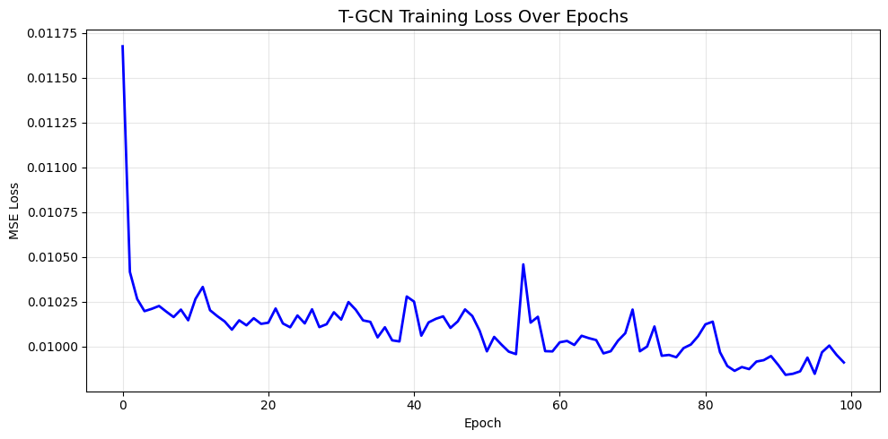
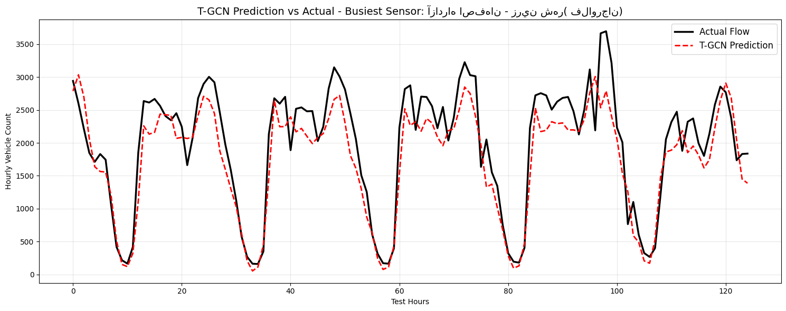
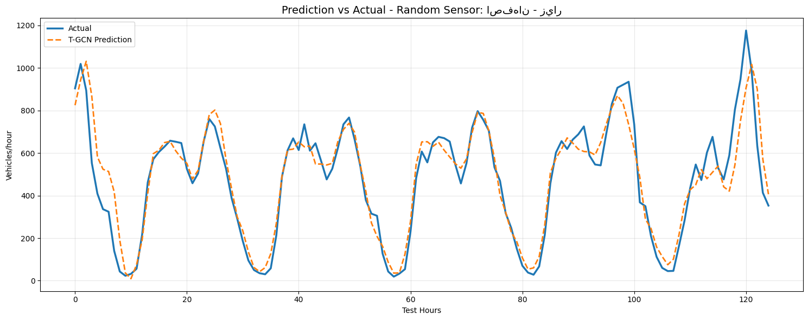
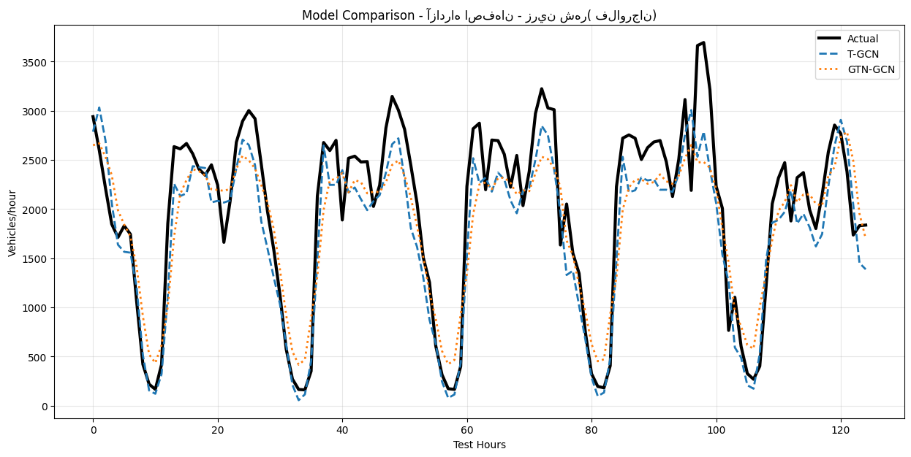

# Graph Mining Course Project Progress Report

**Submission Date:** January 03, 2026  
**Course:** Graph Mining [4041]  
**Instructor:** Dr. Zeinab Maleki  
**Project Title:** Traffic Prediction on the Road Network of Isfahan Province Using Graph-Based Spatiotemporal Models (T-GCN and GTN-GCN)

## Student Information
- **Student Name(s):** Matin Aminsabouri, Amirhossein Lavafi Barzaki  
- **Student ID(s):** 40104173, 40103403  
- **Email(s):** m.aminsabouri@ec.iut.ac.ir , a.lavafi@ec.iut.ac.ir

## Executive Summary
Since the submission of the project proposal, significant progress has been made. Hourly traffic data from road counters in Isfahan Province were obtained from the national open data portal (data.gov.ir). The raw data, spread across multiple Excel files with inconsistent formatting, were successfully cleaned and preprocessed, resulting in a dataset of 49,054 hourly records. A spatial graph with 68 nodes was automatically built using Nominatim geocoding and k-nearest neighbors adjacency. Both T-GCN and GTN-GCN models were fully implemented in PyTorch and trained on multi-feature inputs (traffic flow, average speed, speeding violations, and distance violations). The T-GCN model achieved an MAE of 70.9 vehicles per hour, clearly outperforming GTN-GCN (MAE 83.3), demonstrating its effectiveness in capturing spatiotemporal patterns in real Iranian provincial traffic data. A major deviation from the original plan was the use of hourly instead of daily resolution, which substantially improved the models' ability to learn temporal dynamics. These results validate the applicability of graph-based spatiotemporal models to Iranian traffic data and position the project for successful completion.

## Progress on Objectives
The project has fully achieved all core objectives from the proposal.

### Objective 1: Collect and preprocess traffic counter data from Isfahan Province
Fully achieved. Multiple Excel files were loaded and merged into a single dataframe containing 49,054 rows of hourly data. An automated header detection mechanism handled inconsistent file structures. Persian timestamps were converted to Gregorian format using jdatetime. Key features were extracted, converted to numeric types, and missing values were imputed using forward/backward fill and per-sensor medians. Exploratory statistics confirmed realistic patterns (e.g., mean flow ≈ 335 vehicles/hour, max 3,701).

### Objective 2: Construct a spatial graph representing road network connectivity
Completed. From 109 unique road segments, geographic coordinates were obtained for 68 sensors via Nominatim geocoding with province-specific query enhancement (62.4% success rate). The adjacency matrix was constructed using k-nearest neighbors (k=6), yielding a sparse graph with an average node degree of approximately 5.6, appropriate for graph convolutional networks.

### Objective 3: Implement and evaluate T-GCN and GTN-GCN models for traffic flow prediction
Fully accomplished. Custom PyTorch implementations were trained using a 24-hour input window to predict the next hour's flow. T-GCN converged to a lower loss and delivered superior metrics, highlighting the advantage of GRU-based temporal modeling over GTN-GCN's learnable weights.

## Work Accomplished

### Dataset Preparation and Analysis
The raw dataset consisted of multiple Excel files with hourly measurements from provincial road counters. Automated loading and header correction produced a unified dataframe. Cleaning steps included timestamp conversion, numeric casting, and intelligent imputation. The final multi-feature tensor has shape (743 timesteps × 68 nodes × 4 features), enabling rich spatiotemporal modeling.

### Implementation Details
- **Data Pipeline:** Robust loading with iterative header testing and keyword-based column mapping using pandas.
- **Graph Construction:** Automatic geocoding with rate limiting and k-NN adjacency computation in NumPy/scikit-learn.
- **Modeling:** Custom PyTorch classes for T-GCN (normalized GCN + GRUCell) and GTN-GCN (softmax temporal weights + multi-layer GCN). Training used Adam optimizer, gradient clipping, and Google Colab GPU resources.

### Preliminary Results
Both models were trained for 100 epochs. Quantitative comparison:

| Metric                  | T-GCN       | GTN-GCN     | Notes                          |
|-------------------------|-------------|-------------|--------------------------------|
| MAE (vehicles/hour)     | 70.9       | 83.3       | Primary metric                 |
| RMSE (vehicles/hour)    | 120.6      | 139.2      |                                |
| MAPE (%) (masked y > 10) | 43.4       | 50.2       | Avoids low-flow distortion     |

**Figure 1: T-GCN Training Loss Over Epochs**  

**Figure 2: T-GCN Prediction vs Actual – Busiest Sensor**  

**Figure 3: T-GCN Prediction vs Actual – Random Sensor**  

**Figure 4: Model Comparison on a Sample Sensor**  

Visualization shows T-GCN accurately reproducing daily rush-hour peaks, while GTN-GCN exhibits higher deviations during high-traffic periods.

## Challenges Encountered and Resolutions
- **Challenge 1: Inconsistent Excel file formats and headers**  
  Files varied significantly in structure, with headers often misplaced or missing.  
  **Resolution:** Developed an iterative header detection routine (testing rows 0–2) combined with keyword-based dynamic mapping, enabling successful processing of all files.

- **Challenge 2: Geocoding accuracy for Persian-language road names**  
  Standard queries returned low success rates due to naming ambiguity.  
  **Resolution:** Enhanced query strings with explicit provincial context and implemented rate limiting, increasing success to 62.4%—sufficient for a robust 68-node graph.

- **Challenge 3: Training instability and occasional NaN loss**  
  Early experiments suffered from gradient explosion and normalization issues.  
  **Resolution:** Applied symmetric adjacency normalization with self-loops, gradient clipping, careful data cleaning, and learning rate adjustment, achieving stable convergence.

## References
[1] L. Zhao et al., "T-GCN: A Temporal Graph Convolutional Network for Traffic Prediction," IEEE Transactions on Intelligent Transportation Systems, vol. 21, no. 9, pp. 3848–3858, 2020.  
[2] "GTN-GCN: Real-Time Traffic Forecasting Using Graph Neural Networks," Applied Computational Intelligence and Soft Computing, 2025.  
[3] Isfahan Province Traffic Counter Datasets, National Open Data Portal of Iran (data.gov.ir), 1397 (2018).  
[4] OpenStreetMap Contributors, Nominatim Geocoding Service, accessed 2025.

---
**Student Signature(s):** Matin Aminsabouri, Amirhossein Lavafi Barzaki  
**Date:** January 03, 2026